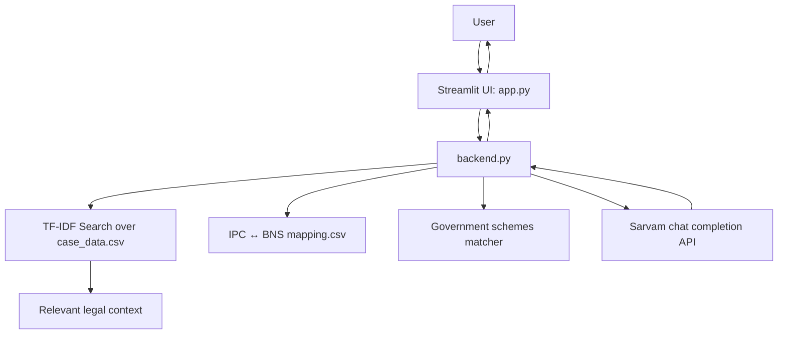

# LegalEase

LegalEase is a Streamlit-based AI legal assistant for Indian law. It helps users understand legal questions by retrieving relevant case-law context, mapping IPC sections to BNS sections, and surfacing relevant government schemes in a chat interfaces.

## What it does

* Answers legal queries in English or Hinglish.
* Retrieves relevant text from `case_data.csv` using TF-IDF + cosine similarity.
* Detects IPC sections from the retrieved context and looks up the matching BNS section from `mapping.csv`.
* Suggests relevant government schemes when the user query matches legal aid, victim support, women safety, cybercrime, or other assistance topics.

## Architecture



### Component flow

1. **`app.py`** renders the chat UI in Streamlit and sends user prompts to the backend.
2. **`backend.py`** builds the legal response.
3. **`case_data.csv`** is searched with TF-IDF and cosine similarity to find relevant legal text.
4. **`mapping.csv`** is used to translate IPC sections into BNS sections.
5. **Sarvam API** generates the final natural-language reply using the retrieved context.

## How to run locally

### 1) Create and activate a virtual environment

```bash
python -m venv .venv
source .venv/bin/activate
```

On Windows:

```bash
.venv\Scripts\activate
```

### 2) Install dependencies

```bash
pip install -r requirements.txt
```

### 3) Make sure these files are present

* `app.py`
* `backend.py`
* `schemes.json`
* `requirements.txt`
* `case_data.csv`
* `mapping.csv`

### 4) Set up API Keys

Configure your Sarvam API keys using one of the following methods:

**Method A: Streamlit Secrets (Recommended)**
Create a file at `.streamlit/secrets.toml` inside the project root directory and add your API keys:
```toml
SARVAM_API_KEYS = "key1,key2,key3"
```

**Method B: Environment Variables**
Set the `SARVAM_API_KEYS` environment variable:
* **Linux/macOS:** `export SARVAM_API_KEYS="key1,key2,key3"`
* **Windows (Cmd):** `set SARVAM_API_KEYS="key1,key2,key3"`
* **Windows (PowerShell):** `$env:SARVAM_API_KEYS="key1,key2,key3"`

### 5) Run the app

```bash
streamlit run app.py
```

## Demo steps

1. Open the app in your browser after running Streamlit.
2. Try one of the sample prompts on the home screen, such as:

   * `What is the punishment for theft?`
   * `Domestic violence ke liye kya section hai?`
   * `Explain dowry laws in India`
   * `Mujhe arrest kiya bina warrant, kya karoon?`
3. Watch the app retrieve legal context, map IPC to BNS, and generate a response.
4. Use the **Dark Mode** toggle in the sidebar to switch themes.
5. Click **Start New Conversation** to clear the chat and begin again.

## Notes

* The app expects a working Sarvam API connection in `backend.py`.
* The legal responses are based on the uploaded dataset and mapping file, so the quality of `case_data.csv` and `mapping.csv` directly affects the output.
* This project is designed for educational and hackathon use.

## Project structure

```text
.
├── app.py
├── backend.py
├── schemes.json
├── requirements.txt
├── case_data.csv
├── mapping.csv
└── README.md
```

## Security & Reliability Enhancements (June 2026)

The project has been refactored with the following improvements:

1. **Security & API Keys:** Hardcoded API keys in `backend.py` have been removed. Keys are now securely loaded dynamically from Streamlit Secrets (`st.secrets`) or standard environment variables (`SARVAM_API_KEYS`).
2. **Correctness of IPC Section Extraction:** The regex in `backend.py` was updated to require legal qualifiers (like "Section", "Sec", "IPC", "dhara") before extracting a section number, preventing false positives from matching arbitrary 3-digit numbers such as years (1860) or helpline numbers (1098).
3. **Exact BNS Mapping Resolution:** Refactored the mapping logic to search the structured dictionary metadata in the `response` column of `mapping.csv` rather than performing loose substring matching. This ensures queries for specific sections (like `Section 37`) don't return unrelated sections (like `Section 376`).
4. **Government Schemes Database:** Government schemes were extracted from the codebase into a clean, maintainable `schemes.json` configuration file.
5. **Modern Theme Contrast:** Polished Streamlit dark mode contrast dynamically, solving the problem of unreadable black text on light grey backgrounds for chat input fields in dark mode.
